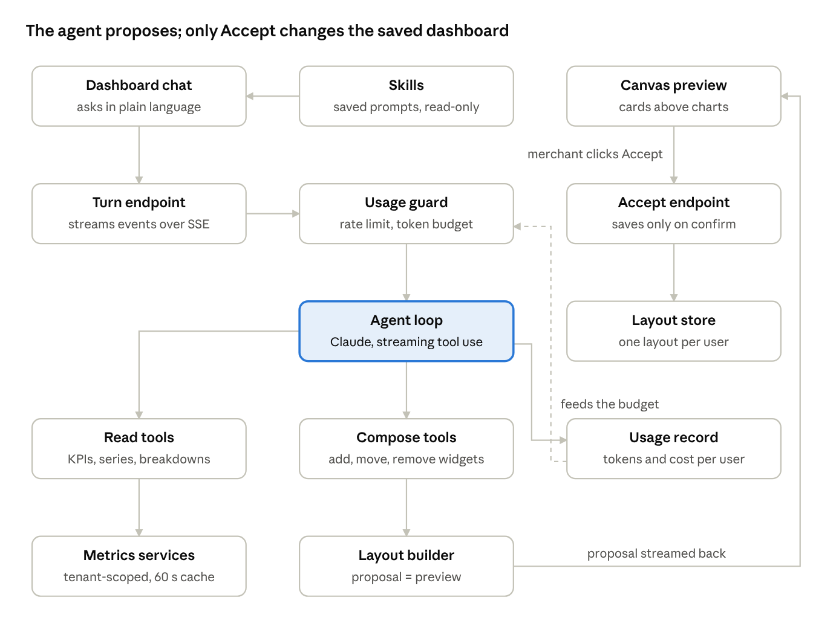
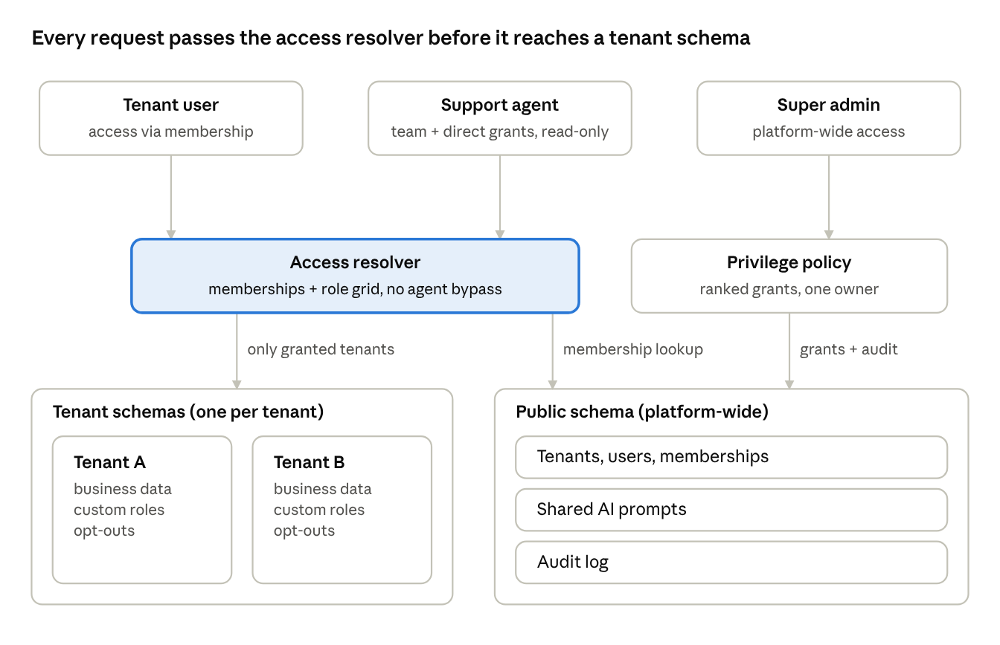

# Musa — Case Studies

Software engineer building AI agents, payments systems and multi-tenant SaaS products.

## Case studies

### [Merchant Dashboard Agent](merchant-dashboard-agent/)

An embedded AI assistant that turns plain-language questions into live dashboard views for a multi-tenant payments platform, with Skills, cost limits and tenant isolation.

**Stack:** Python, Django, Anthropic Claude, SSE, PostgreSQL, Playwright

### [Multi-Tenant Access Control](multi-tenant-access-control/)

Custom roles and section-wise permissions per tenant, a cross-tenant support role and privilege-escalation guardrails for a schema-per-tenant payments SaaS.

**Stack:** Python, Django, django-tenants, PostgreSQL, Next.js, Playwright

## Contact

- Email: [amsohag007@gmail.com](mailto:amsohag007@gmail.com)
- LinkedIn: [linkedin.com/in/amsohag007](https://www.linkedin.com/in/amsohag007)
- GitHub: [amsohag007](https://github.com/amsohag007)
